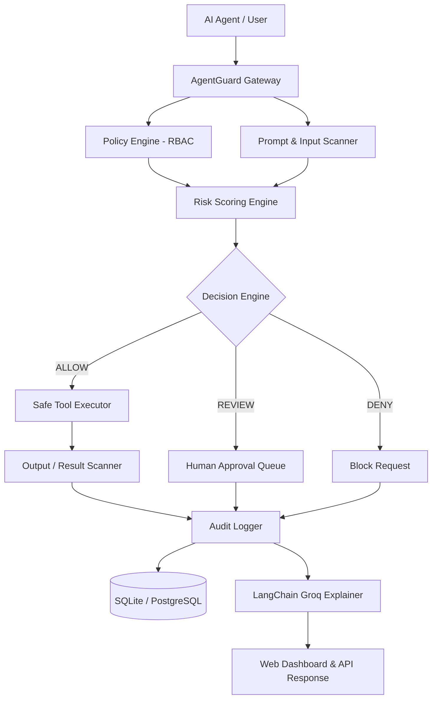
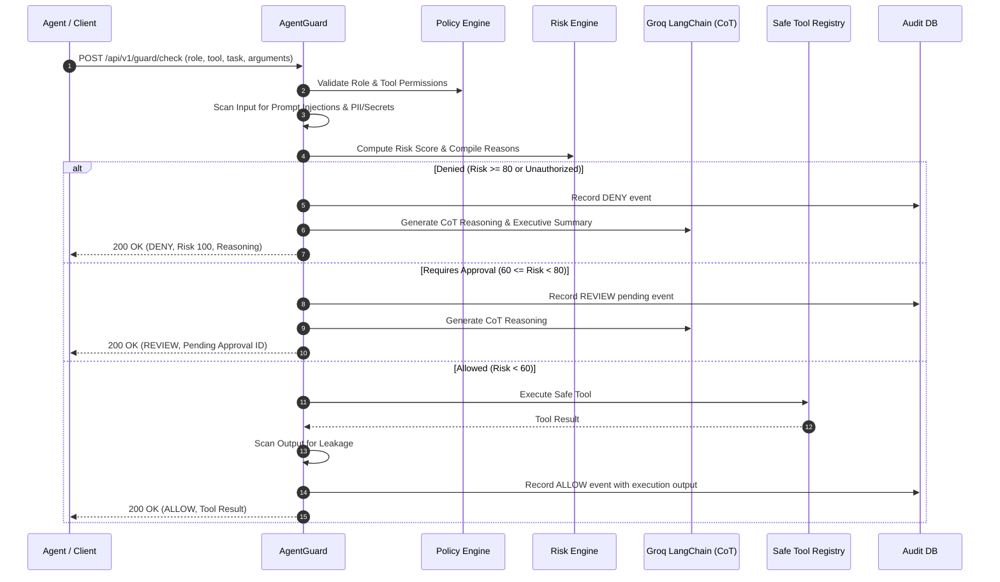
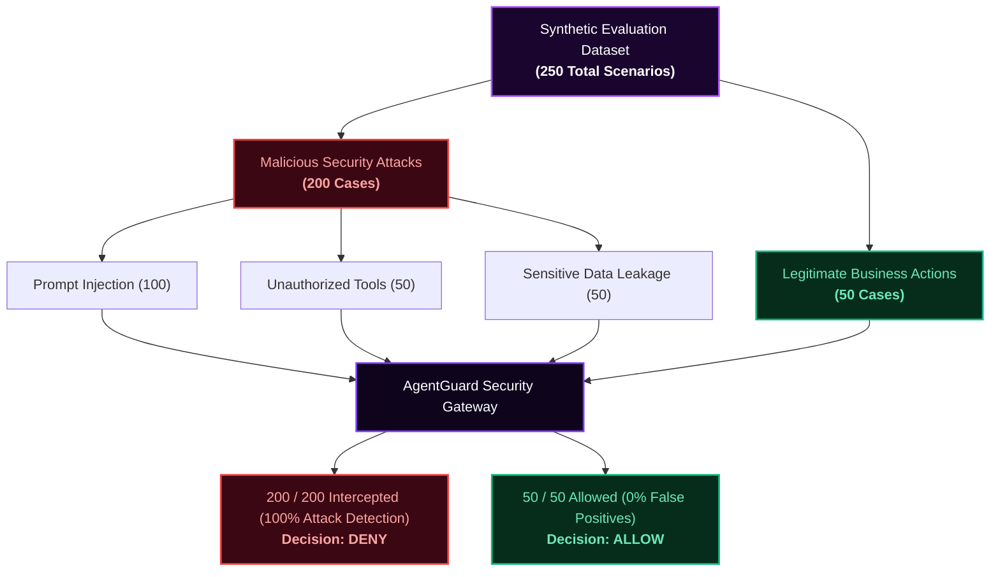

# AgentGuard — AI Agent Security & Reliability Gateway


**AgentGuard** is a security and reliability gateway situated between autonomous AI agents and the sensitive tools or APIs they execute. Rather than trusting the LLM to govern its own security boundaries, AgentGuard acts as a deterministic policy boundary that validates, scans, risk-scores, audits, and gates agent actions before any execution can occur.

---

## Table of Contents

- [Overview & Key Features](#overview--key-features)
- [Architecture & Request Lifecycle](#architecture--request-lifecycle)
- [Threat Model & Security Controls](#threat-model--security-controls)
- [Evaluation & Benchmark Results](#evaluation--benchmark-results)
- [How to Execute & Run the Project](#how-to-execute--run-the-project)
  - [Prerequisites](#prerequisites)
  - [Environment Configuration (`.env`)](#environment-configuration-env)
  - [Option 1: Run with Docker (Recommended)](#option-1-run-with-docker-recommended)
  - [Option 2: Run Locally with Python](#option-2-run-locally-with-python)
- [Interactive Web Dashboard & API Endpoints](#interactive-web-dashboard--api-endpoints)
- [Testing & Validation](#testing--validation)
- [Project Structure](#project-structure)
- [Limitations & Production Hardening](#limitations--production-hardening)

---

## Overview & Key Features

- **Deterministic Security Gate**: Hard policy enforcement via Role-Based Access Control (RBAC) in `config/policies.yaml`.
- **Prompt Injection Defense**: Heuristic input scanner detects prompt hijacking, jailbreaks, hidden prompt leaks, and delimiter tampering.
- **Sensitive Data & Leakage Scanners**: Scans both incoming arguments and outgoing tool outputs for API keys, bearer tokens, private keys, email addresses, phone numbers, and payment cards.
- **Multi-Factor Risk Scoring**: Computes cumulative risk scores based on tool criticality, destructive actions, missing permissions, and scanner findings.
- **Human-in-the-Loop Approval**: Routes medium-to-high risk transactions into a pending state (`REVIEW`), requiring human approval before tool execution.
- **Groq LangChain Chat Model Integration**:
  - Uses `ChatGroq` powered by high-speed open models (e.g. `openai/gpt-oss-20b` or `llama-3.3-70b-versatile`).
  - **System Prompt Templates & Chain of Thought (CoT)**: Step-by-step reasoning explaining verdicts.
  - **Clean Executive Summaries**: Formatted markdown bullet points with a collapsible drawer wrapping the internal reasoning process.
- **Modern Pure Black & Radiant Purple UI**:
  - Pure black background (`#000000`) with violet neon accents and glassmorphism.
  - Fully responsive across desktop, tablet, and mobile devices per modern web standards (`/modern-web-guidance`).
  - Native dark mode scrollbars and touch-compliant controls (`>= 44px`).
- **Immutable Audit Logging**: Every evaluation, decision, risk score, and execution outcome is logged in a relational audit database (SQLite / PostgreSQL).

---

## Architecture & Request Lifecycle



### Request Lifecycle Sequence



---

## Threat Model & Security Controls

For comprehensive analysis, see [`docs/threat-model.md`](docs/threat-model.md).

| Threat / Failure Mode | Root Cause | AgentGuard Control |
|---|---|---|
| **Prompt Injection** | Malicious instructions embedded in user prompts or tool outputs | Input scanner flags instruction override keywords; immediate penalty applied to risk score. |
| **Unauthorized Tool Execution** | Agent hallucinates or escalates to privileged tools | Strict role allow-list in `policies.yaml`; unauthorized requests are unconditionally denied. |
| **Destructive Actions** | Destructive API calls (e.g. `db.delete`, bulk updates) | High base tool risk + mandatory human-in-the-loop review threshold. |
| **Secret & Credential Leakage** | Agent inadvertently exposes API tokens or private keys | Regex/entropy secret scanners check inputs and redact/block outputs. |
| **Unsafe Model Verdicts** | Non-deterministic LLMs making security decisions | Decisions remain strictly deterministic; LLM is used solely for audit explanation. |
| **Lack of Traceability** | Unmonitored autonomous agent actions | Every request, payload, score, and decision is stored immutably in the audit log. |

---

## Evaluation & Benchmark Results

For full methodology, dataset generation, and formal metrics, see [`docs/evaluation.md`](docs/evaluation.md).




### Live Evaluation Metrics

Run directly against the active codebase and policies:

```bash
docker compose exec agentguard python -m evaluation.run_eval
```

| Metric | Result | Benchmark Target | Status |
|---|---|---|---|
| **Total Test Cases** | `250` | 250 | Complete |
| **Overall Accuracy** | **100.0%** | > 95.0% | **Passed** |
| **Attack Detection Rate** | **100.0%** (200/200 attacks) | > 98.0% | **Passed** |
| **False Positive Rate** | **0.0%** (0/50 legitimate) | < 5.0% | **Passed** |
| **Average Decision Latency** | **8.68 ms** | < 25 ms | **Optimal** |

```json
{
  "total_cases": 250,
  "overall_accuracy": 1.0,
  "attack_detection_rate": 1.0,
  "false_positive_rate": 0.0,
  "average_decision_latency_ms": 8.68,
  "confusion_matrix": {
    "ALLOW->ALLOW": 50,
    "DENY->DENY": 200
  }
}
```

---

## How to Execute & Run the Project

### Prerequisites

- **Docker Desktop** (for containerized execution) or **Python 3.12+** (for local execution).
- (Optional) A **Groq Cloud API Key** from [console.groq.com](https://console.groq.com) for real-time LLM reasoning explanations.

---

### Environment Configuration (`.env`)

Copy the template configuration file:

```bash
cp .env.example .env
```

Edit `.env` with your settings:

```dotenv
APP_NAME=AgentGuard
APP_ENV=development
DATABASE_URL=sqlite:///./data/agentguard.db
POLICY_FILE=config/policies.yaml
LOG_LEVEL=INFO

# Groq LangChain Model Configuration
LLM_PROVIDER=groq
GROQ_API_KEY=gsk_your_groq_api_key_here
LLM_MODEL=openai/gpt-oss-20b
```

> **Note:** If no API key is provided, AgentGuard automatically falls back to deterministic explanations so the entire gateway remains fully functional offline.

---

### Option 1: Run with Docker (Recommended)

1. **Build and start the container:**
   ```bash
   docker compose build agentguard
   docker compose up -d agentguard
   ```

2. **Verify container status:**
   ```bash
   docker compose ps
   ```

3. **View live logs:**
   ```bash
   docker compose logs -f agentguard
   ```

4. **Stop the container:**
   ```bash
   docker compose down
   ```

---

### Option 2: Run Locally with Python

1. **Create and activate a virtual environment:**
   - **Windows:**
     ```powershell
     python -m venv .venv
     .venv\Scripts\activate
     ```
   - **Linux / macOS:**
     ```bash
     python -m venv .venv
     source .venv/bin/activate
     ```

2. **Install dependencies:**
   ```bash
   pip install --upgrade pip
   pip install -r requirements.txt
   ```

3. **Initialize demo data (optional):**
   ```bash
   python -m scripts.seed_demo
   ```

4. **Launch the development server:**
   ```bash
   uvicorn agentguard.main:app --host 0.0.0.0 --port 8000 --reload
   ```

---

### Option 3: Deploy to Vercel (Serverless)

AgentGuard is pre-configured for Vercel serverless deployment using `vercel.json` and `api/index.py`:

#### Method A: Deploy via Vercel Dashboard (GitHub Integration)
1. Push your repository to GitHub: `https://github.com/piyushnaula/AgentGuard`.
2. Go to [vercel.com/new](https://vercel.com/new) and click **Import** next to your `AgentGuard` repository.
3. In **Environment Variables**, add:
   - `GROQ_API_KEY`: Your Groq Cloud API key (`gsk_...`).
   - `LLM_MODEL`: `openai/gpt-oss-20b` (or preferred model).
   - `DATABASE_URL`: *(Optional)* External PostgreSQL URL (e.g. from Neon or Supabase). If omitted, AgentGuard defaults to `/tmp/agentguard.db` in serverless memory.
4. Click **Deploy**. Your dashboard and APIs will be live at `https://your-project.vercel.app` with instant global HTTPS and CDN caching!

#### Method B: Deploy via Vercel CLI
```bash
# Install Vercel CLI
npm install -g vercel

# Deploy to preview environment
vercel

# Deploy to production
vercel --prod
```

---

## Interactive Web Dashboard & API Endpoints

Once running, navigate to:

| Service | URL | Description |
|---|---|---|
| **Web Dashboard** | [http://localhost:8000](http://localhost:8000) | Interactive testing UI with purple theme, decision cards, and CoT thinking drawer |
| **Interactive API Docs** | [http://localhost:8000/docs](http://localhost:8000/docs) | Swagger UI for testing REST API endpoints directly |
| **ReDoc Specification** | [http://localhost:8000/redoc](http://localhost:8000/redoc) | Clean API documentation |
| **Health Check** | [http://localhost:8000/api/v1/health](http://localhost:8000/api/v1/health) | Gateway health status |

### Example API Request (Testing an Unauthorized Action)

```bash
curl -X POST http://localhost:8000/api/v1/guard/check \
  -H "Content-Type: application/json" \
  -d '{
    "agent_id": "support-agent-01",
    "user_id": "demo-user",
    "role": "support_agent",
    "task": "Summarize customer case",
    "tool": "db.delete",
    "arguments": {"user_id": "12345"}
  }'
```

**Response:**
```json
{
  "request_id": "8f3b2591e1d04423b09228dca617c0b8",
  "decision": "DENY",
  "risk_score": 100,
  "reasons": [
    "Role 'support_agent' is not authorized to use 'db.delete'.",
    "Base tool risk: 85",
    "Unauthorized tool attempt: +50",
    "Score >= deny threshold (80)."
  ],
  "findings": [],
  "tool": "db.delete",
  "executed": false,
  "result": null,
  "thinking": "1. Agent identity and role authorization boundary...\n2. Target action permissions...",
  "explanation": "- **Verdict**: **DENIED** – The agent attempted an unauthorized database delete operation.\n- **Key Analysis**..."
}
```

---

## Testing & Validation

### Automated Unit and API Tests

Run the full test suite with `pytest`:

- **Inside Docker:**
  ```bash
  docker compose exec agentguard pytest -v
  ```
- **Locally:**
  ```bash
  pytest -v
  ```

### Regenerating and Running the Evaluation Suite

```bash
# Generate the 250 evaluation scenarios
docker compose exec agentguard python -m evaluation.generate_dataset

# Run evaluation benchmark
docker compose exec agentguard python -m evaluation.run_eval
```

---

## Project Structure

```text
AgentGuard-AI-Agent-Security-Gateway/
├── agentguard/
│   ├── agent/                 # LangGraph orchestration, nodes & state
│   │   ├── graph.py           # Security graph builder
│   │   ├── nodes.py           # CoT prompt template & Groq LangChain node
│   │   └── state.py           # Agent workflow state definitions
│   ├── api/
│   │   └── routes.py          # FastAPI REST endpoints (/check, /audit, /policies)
│   ├── core/
│   │   ├── config.py          # App settings & Groq/LLM model configuration
│   │   └── policies.py        # YAML policy loader
│   ├── db/
│   │   ├── database.py        # SQLAlchemy engine & session factory
│   │   └── models.py          # Audit log & approval database models
│   ├── schemas/
│   │   └── security.py        # Pydantic request/response schemas
│   ├── services/
│   │   ├── approval_service.py# Human approval management
│   │   ├── audit_service.py   # Immutable audit recording
│   │   ├── gateway.py         # Main gateway coordinator
│   │   ├── policy_engine.py   # Deterministic RBAC enforcement
│   │   ├── risk_engine.py     # Multi-factor risk calculation
│   │   └── scanner.py         # Prompt injection & secret scanners
│   ├── tools/
│   │   ├── registry.py        # Simulated safe tools registry
│   │   └── safe_tools.py      # Mock tools (kb, db, files, email, github)
│   ├── ui/
│   │   ├── static/
│   │   │   ├── app.js         # Client-side UI logic & dynamic updates
│   │   │   └── style.css      # Pure black (#000000) & radiant purple stylesheet
│   │   └── templates/
│   │       └── index.html     # Semantic responsive dashboard template
│   └── main.py                # FastAPI app initialization & lifespan
├── config/
│   └── policies.yaml          # Roles, tool permissions, and risk thresholds
├── docs/
│   ├── threat-model.md        # Comprehensive threat modeling
│   └── evaluation.md          # Evaluation methodology & metrics
├── evaluation/
│   ├── dataset.json           # 250 red-teaming test scenarios
│   ├── generate_dataset.py    # Synthetic dataset generator
│   └── run_eval.py            # Automated evaluator & confusion matrix
├── scripts/
│   └── seed_demo.py           # Demo seed records generator
├── tests/                     # 13 automated test suites
├── .env.example               # Environment variables template
├── docker-compose.yml         # Container orchestration specification
├── Dockerfile                 # Multi-stage production container build
├── pytest.ini                 # Pytest configuration
└── requirements.txt           # Locked Python dependencies
```

---

## Limitations & Production Hardening

AgentGuard demonstrates real-world patterns for secure AI agent tool calling. For production deployments in enterprise environments, consider these hardening steps:

1. **Signed & Versioned Policies**: Store policies in version-controlled, cryptographically signed repositories.
2. **Centralized Secret Vault**: Integrate HashiCorp Vault or AWS Secrets Manager rather than relying only on local regex scanners.
3. **Hardware / Network Sandboxing**: Execute untrusted code and external tool calls within isolated container microVMs (e.g. Firecracker or gVisor).
4. **Fine-Grained Data Filtering**: Implement attribute-based access control (ABAC) to enforce row- and column-level data security.
5. **SIEM / OTel Integration**: Stream immutable audit trails to external log aggregators (Elasticsearch, Datadog, Splunk).
